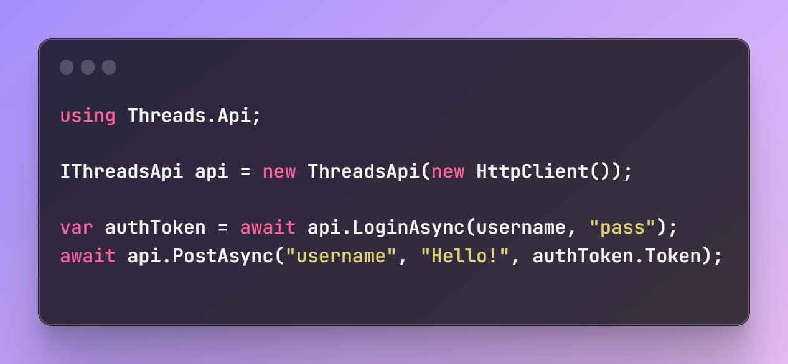

<a name="readme-top"></a>

<div align="center">

[![Contributors][contributors-shield]][contributors-url]
[![Forks][forks-shield]][forks-url]
[![Stargazers][stars-shield]][stars-url]
[![Issues][issues-shield]][issues-url]

</div>

<br />
<div align="center">


<h3 align="center">Threads.Api</h3>

  <p align="center">
    An unoffical .Net wrapper for the meta Threads API
    <br />
    <!-- <a href="https://github.com/tidusjar/Threads.Api"><strong>Explore the docs »</strong></a> -->
    <br />
    <br />
    <!-- <a href="https://github.com/tidusjar/Threads.Api">View Demo</a> -->
    <a href="https://github.com/tidusjar/Threads.Api/issues">Report Bug</a>
    ·
    <a href="https://github.com/tidusjar/Threads.Api/issues">Request Feature</a>
  </p>
</div>

## Usage

<!-- [![Product Name Screen Shot][product-screenshot]](https://example.com) -->
 
  
  


<!-- ### Built With -->

<!-- * [![Next][Next.js]][Next-url]
* [![React][React.js]][React-url]
* [![Vue][Vue.js]][Vue-url]
* [![Angular][Angular.io]][Angular-url]
* [![Svelte][Svelte.dev]][Svelte-url]
* [![Laravel][Laravel.com]][Laravel-url]
* [![Bootstrap][Bootstrap.com]][Bootstrap-url]
* [![JQuery][JQuery.com]][JQuery-url] -->


<br>

### Post
```csharp
IThreadsApi api = new ThreadsApi(new HttpClient());
var authToken = await api.GetTokenAsync("tidusjar", "password");
await api.PostAsync("tidusjar", "Hello!", authToken);
```

### Follow & UnFollow
```csharp
IThreadsApi api = new ThreadsApi(new HttpClient());

var authToken = await api.GetTokenAsync("tidusjar", "password");

var userNameToFollow = "zuck";
var userToFollow = await api.GetUserIdFromUserNameAsync(userNameToFollow);
await api.FollowAsync(userToFollow.UserId, userToFollow.Token, authToken);
await api.UnFollowAsync(userToFollow.UserId, userToFollow.Token, authToken);
```


See the [open issues](https://github.com/tidusjar/Threads.Api/issues) for a full list of proposed features (and known issues).


<!-- CONTRIBUTING -->
## Contributing

Contributions are what make the open source community such an amazing place to learn, inspire, and create. Any contributions you make are **greatly appreciated**.

If you have a suggestion that would make this better, please fork the repo and create a pull request. You can also simply open an issue with the tag "enhancement".
Don't forget to give the project a star! Thanks again!

1. Fork the Project
2. Create your Feature Branch (`git checkout -b feature/AmazingFeature`)
3. Commit your Changes (`git commit -m 'Add some AmazingFeature'`)
4. Push to the Branch (`git push origin feature/AmazingFeature`)
5. Open a Pull Request


<!-- CONTACT -->
## Contact

Your Name - [@tidusjar](https://twitter.com/@tidusjar) - tidusjar@gmail.com

Project Link: [https://github.com/tidusjar/Threads.Api](https://github.com/tidusjar/Threads.Api)


<!-- MARKDOWN LINKS & IMAGES -->
<!-- https://www.markdownguide.org/basic-syntax/#reference-style-links -->
[contributors-shield]: https://img.shields.io/github/contributors/tidusjar/Threads.Api.svg?style=for-the-badge
[contributors-url]: https://github.com/tidusjar/Threads.Api/graphs/contributors
[forks-shield]: https://img.shields.io/github/forks/tidusjar/Threads.Api.svg?style=for-the-badge
[forks-url]: https://github.com/tidusjar/Threads.Api/network/members
[stars-shield]: https://img.shields.io/github/stars/tidusjar/Threads.Api.svg?style=for-the-badge
[stars-url]: https://github.com/tidusjar/Threads.Api/stargazers
[issues-shield]: https://img.shields.io/github/issues/tidusjar/Threads.Api.svg?style=for-the-badge
[issues-url]: https://github.com/tidusjar/Threads.Api/issues
[license-shield]: https://img.shields.io/github/license/tidusjar/Threads.Api.svg?style=for-the-badge
[license-url]: https://github.com/tidusjar/Threads.Api/blob/main/LICENSE.txt